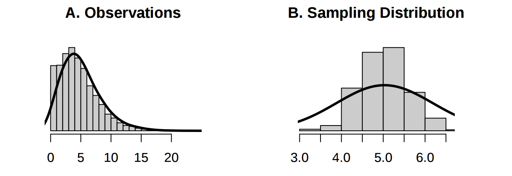

```{r, eval=FALSE, echo=FALSE}
# The following two commands will install a LaTeX installation so that the document can be compiled to PDF. These only need to be run once per R installation.

```

```{r, echo=FALSE}
options(digits = 2)
library(kableExtra)
```

# Part I

Please put the answers for Part I next to the question number (2pts each):

##### 1. A student is gathering data on the driving experiences of other college students. A description of the data car color is presented below. Which of the variables are quantitative and discrete?

Car: 1 = compact, 2 = standard size, 3 = mini van, 4 = SUV, and 5 = truck 
Color: red, blue, green, black, white 
daysDrive: number of days per week the student drives 
gasMonth: the amount of money the student spends on gas per month 

a). car 
a). daysDrive
a). daysDrive, car 
a). daysDrive, gasMonth 
a). car, daysDrive, gasMonth 

##### Answer

The answer is (B) since it quantifies variable that can occur in jumps and can have only positive values. Car is categorical and numerical, gasMonth can be taken as a numerical variable which can take a wide range of numerical values


##### 2. A histogram of the GPA of 132 students from this course in Fall 2012 class is presented below. Which estimates of the mean and median are most plausible?


##### Answer

The answer is option (A). Reason: the distribution is left skewed which implies that the mean is smaller than the median. Option C also has a mean smaller than the median but because the median should be around 3.5 or so, 3.8 is a little too high for it. So, option (A) is most plausible option.


##### 3. A researcher wants to determine if a new treatment is effective for reducing Ebola related fever. What type of study should be conducted in order to establish that the treatment does indeed cause improvement in Ebola patients? 

a). Randomly assign Ebola patients to one of two groups, either the treatment or placebo group, and then compare the fever of the two groups. 
b). Identify Ebola patients who received the new treatment and those who did not, and then compare the fever of those two groups. 
c). Identify clusters of villages and then stratify them by gender and compare the fevers of male and female groups. 
d). Both studies (a) and (b) can be conducted in order to establish that the treatment does indeed cause improvement with regards to fever in Ebola patients. <- ANSWER 

##### Answer is option (d)

4. A study is designed to test whether there is a relationship between natural hair color (brunette, blond, red) and eye color (blue, green, brown). If a large \x^2\ test statistic is obtained, this suggests that:

a. there is a difference between average eye color and average hair color.
b. a person's hair color is determined by his or her eye color.
c. there is an association between natural hair color and eye color.
d. eye color and natural hair color are independent

##### Answer is option (A): Larger chi-square values point strongly implies that the null hypothesis does not stand we usually take null hypothesis that the mean (average) is the same.

##### 5.  A researcher studying how monkeys remember is interested in examining the distribution of the score on a standard memory task. The researcher wants to produce a boxplot to examine this distribution. Below are summary statistics from the memory task. What values should the researcher use to determine if a particular score is a potential outlier in the boxplot?

```{r}
outp <- data.frame(min = 26, Q1 = 37, median = 45, Q3 = 49.8, max = 65, mean = 44.4, sd = 8.4, n = 50)
outp
```

a. 37.0 and 49.8
b. 17.8 and 69.0
c. 36.0 and 52.8
d. 26.0 and 50.0
e. 19.2 and 69.9

##### Answer

```{r}
Q1 <- 37
Q3 <- 49.8

IQR <- Q3 - Q1
IQR <- 49.8 - 37

```


```{r}
Upper_limit <- Q3 + 1.5 * IQR
Upper_limit

```


```{r}
Lower_Limit <- Q1 - 1.5 * IQR
Lower_Limit

```

##### The answer is option (B)


##### 6. The are resistant to outliers, whereas the are not.

a. mean and median; standard deviation and interquartile range
b. mean and standard deviation; median and interquartile range
c. standard deviation and interquartile range; mean and median
d. median and interquartile range; mean and standard deviation
e. median and standard deviation; mean and interquartile range

##### Answer: option (D)


##### 7a. Figure A below represents the distribution of an observed variable. Figure B below represents the distribution of the mean from 500 random samples of size 30 from A. The mean of A is 5.05 and the mean of B is 5.04. The standard deviations of A and B are 3.22 and 0.58, respectively. Describe the two distributions (2pts).

```{r}



```


##### Answer: Both are unimodal. A is right-skewed while B appears to be left-skewed. Both are normal distributions. The means are not equal but if more samples are used, the value might improve.


7b.Explain why the means of these two distributions are similar but the standard deviations are not (2 pts).

##### Answer: The means are similar because the distribution of the mean from 500 random samples of size 30 from Observation A followed a normal distribution (The samplings are random and the minimum number of samples requird for normal distribution is followed). As for the standard deviation, the distribution of the observations are farther from the mean than in the Sampling Distribution.


##### 7c. What is the statistical principal that describes this phenomenon (2 pts)?

##### Answer:

The Central Limit Theorem (CLT). All the conditions are satisfied. 

The Conditions include:
1). samples are independent and random 
2). Data is not strongly skwed. 
3). Distribution is approximately normal.


# Part II

Consider the four datasets, each with two columns (x and y), provided below. Be sure to replace the `NA` with your answer for each part (e.g. assign the mean of `x` for `data1` to the `data1.x.mean` variable). When you Knit your answer document, a table will be generated with all the answers.

```{r}
options(digits=2)
data1 <- data.frame(x=c(10,8,13,9,11,14,6,4,12,7,5),
					y=c(8.04,6.95,7.58,8.81,8.33,9.96,7.24,4.26,10.84,4.82,5.68))
data2 <- data.frame(x=c(10,8,13,9,11,14,6,4,12,7,5),
					y=c(9.14,8.14,8.74,8.77,9.26,8.1,6.13,3.1,9.13,7.26,4.74))
data3 <- data.frame(x=c(10,8,13,9,11,14,6,4,12,7,5),
					y=c(7.46,6.77,12.74,7.11,7.81,8.84,6.08,5.39,8.15,6.42,5.73))
data4 <- data.frame(x=c(8,8,8,8,8,8,8,19,8,8,8),
					y=c(6.58,5.76,7.71,8.84,8.47,7.04,5.25,12.5,5.56,7.91,6.89))
```

For each column, calculate (to two decimal places):

#### a. The mean (for x and y separately; 1 pt).

```{r include=TRUE}
(data1.x.mean <- round(mean(data1$x), 2))
(data1.y.mean <- round(mean(data1$y), 2))
(data2.x.mean <- round(mean(data2$x), 2))
(data2.y.mean <- round(mean(data2$y), 2))
(data3.x.mean <- round(mean(data3$x), 2))
(data3.y.mean <- round(mean(data3$y), 2))
(data4.x.mean <- round(mean(data4$x), 2))
(data4.y.mean <- round(mean(data4$y), 2))
```

#### b. The median (for x and y separately; 1 pt).

```{r include=TRUE}
(data1.x.median <- round(median(data1$x), 2))
(data1.y.median <- round(median(data1$y), 2))
(data2.x.median <- round(median(data2$x), 2))
(data2.y.median <- round(median(data2$y), 2))
(data3.x.median <- round(median(data3$x), 2))
(data3.y.median <- round(median(data3$y), 2))
(data4.x.median <- round(median(data4$x), 2))
(data4.y.median <- round(median(data4$y), 2))
```

#### c. The standard deviation (for x and y separately; 1 pt).

```{r include=TRUE}
(data1.x.sd <- round(sd(data1$x), 2))
(data1.y.sd <- round(sd(data1$y), 2))
(data2.x.sd <- round(sd(data2$x), 2))
(data2.y.sd <- round(sd(data2$y), 2))
(data3.x.sd <- round(sd(data3$x), 2))
(data3.y.sd <- round(sd(data3$y), 2))
(data4.x.sd <- round(sd(data4$x), 2))
(data4.y.sd <- round(sd(data4$y), 2))
```

#### For each x and y pair, calculate (also to two decimal places; 1 pt):

#### d. The correlation (1 pt).

```{r include=TRUE}
(data1.correlation <- round(cor(data1), 2))
(data2.correlation <- round(cor(data2), 2))
(data3.correlation <- round(cor(data3), 2))
(data4.correlation <- round(cor(data4), 2))
```

#### e. Linear regression equation (2 pts).

```{r include=TRUE}
(data1.slope <- lm(y ~ x,data = data1))
summary(data1.slope)
(data2.slope <- lm(y ~ x,data = data2))
summary(data2.slope)
(data3.slope <- lm(y ~ x,data = data3))
summary(data3.slope)
(data4.slope <- lm(y ~ x,data = data4))
summary(data4.slope)

```

##### The intercepts:

```{r}

data1.intercept <- 3.0
data2.intercept <- 3.0
data3.intercept <- 3.0
data4.intercept <- 3.0

```

##### The equations of linear regression:

1). data1: y = 3.000 + 0.500 * x
2). data2: y = 3.001 + 0.500 * x
3). data3: y = 3.002 + 0.500 * x
4). data4: y = 3.002 + 0.500 * x


#### f. R-Squared (2 pts).

```{r include=TRUE}
(data1.rsquared <- summary(data1.slope)$r.squared)
(data2.rsquared <- summary(data2.slope)$r.squared)
(data3.rsquared <- summary(data3.slope)$r.squared)
(data4.rsquared <- summary(data4.slope)$r.squared)
```


#### g. For each pair, is it appropriate to estimate a linear regression model? Why or why not? Be specific as to why for each pair and include appropriate plots! (4 pts)


##### Answer:

Conditions for linear regression model:

1). Linearity
2). Nearly normal residuals
3). Constant variability
4). Observations are independent of each other


##### data1

```{r}
par(mfrow=c(2,2))
plot(data1, xlab = "x", ylab = "y", main = "y vs x")
hist(data1.slope$residuals, xlab = "Residuals", ylab = "Frequency", main = "Histogram of data1 residuals")
qqnorm(data1.slope$residuals)
qqline(data1.slope$residuals)
```

From the above plots for data1, we can see that the main plot does not show much of linearity. While the Q-Q plot shows fairly normal distribution with some outliers above and below the q-q line, I can't say exactly what the nature of the histogram is. So, I will say that linear regression model is not appropriate in this case.


##### data2

```{r}

par(mfrow=c(2,2))
plot(data2, xlab = "x", ylab = "y", main = "y vs x")
hist(data2.slope$residuals, xlab = "Residuals", ylab = "Frequency", main = "Histogram of data2 residuals")
qqnorm(data2.slope$residuals)
qqline(data2.slope$residuals)

```

Here, we can see that the main plot has a curve which shows that it is not linear in nature. Therefore, linear regression model will not be appropriate.


##### data3

```{r}

par(mfrow=c(2,2))
plot(data3, xlab = "x", ylab = "y", main = "y vs x")
hist(data3.slope$residuals, xlab = "Residuals", ylab = "Frequency", main = "Histogram of data3 residuals")
qqnorm(data3.slope$residuals)
qqline(data3.slope$residuals)

```

For data3, the plot shows some linearity with some outliers and the histogram shows that distribution is approximately normal though its output is affected by the presence of outliers.The variability of graph changes as changes are observed in x- values.Therefore linear regression model is not appropriate.


##### data4

```{r}

par(mfrow=c(2,2))
plot(data4, xlab = "x", ylab = "y", main = "y vs x")
hist(data4.slope$residuals, xlab = "Residuals", ylab = "Frequency", main = "Histogram of data4 residuals")
qqnorm(data4.slope$residuals)
qqline(data4.slope$residuals)

```

For data4, the main plot does not have linear relationship and the histogram for residuals does not show normal distribution. So, linear regression model will not be appropriate.


#### h. Explain why it is important to include appropriate visualizations when analyzing data. Include any visualization(s) you create. (2 pts)

##### It is important to include visualisations when analysing data because 

1). They help us to identify outliers in the model
2). They serve as the first provider of insight in a snapshot into the nature of the data set
3). They help us to build conclusions and prediction about the data set
4). They help convey the result to an ordinary reader (a layman) in the most easily presentable form.


