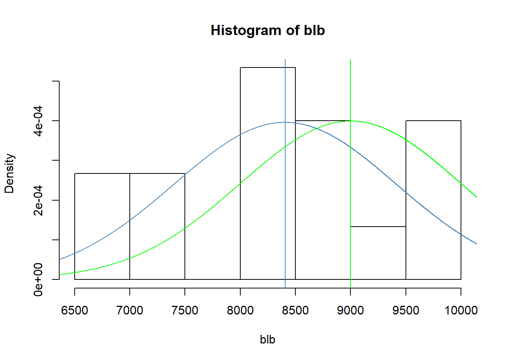
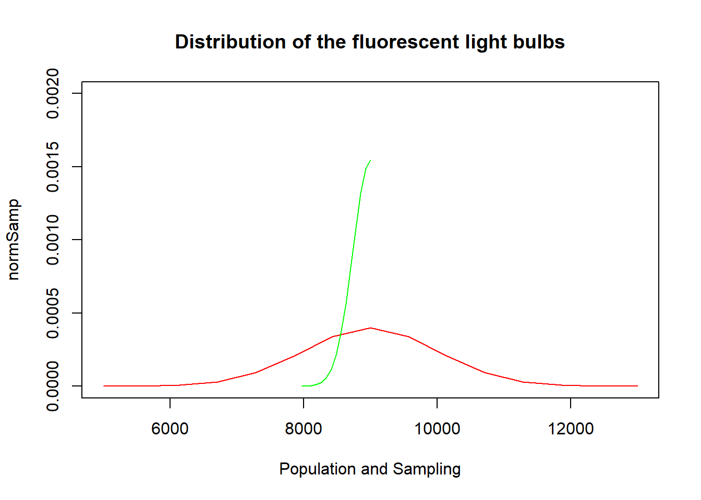

#### 4.4 Heights of adults. 
Researchers studying anthropometry collected body girth measurements and skeletal diameter measurements, as well as age, weight, height and gender, for 507 physically active individuals. The histogram below shows the sample distribution of heights in centimeters.

```r
knitr::include_graphics('https://raw.githubusercontent.com/henryvalentine/MSDS2019/master/Classes/DATA%20606/Home%20works/img1.png')
```

<!-- -->

(a) What is the point estimate for the average height of active individuals? What about the
median?

Answer:

##### The point Estimate is 171.1, the Point Estimate Median is 170.3

(b) What is the point estimate for the standard deviation of the heights of active individuals?
What about the IQR?

Answer:

##### The point Estimate standard Deviation is 9.4, the IQR is 177.8 - 163.8 = 14

(c) Is a person who is 1m 80cm (180 cm) tall considered unusually tall? And is a person who is
1m 55cm (155cm) considered unusually short? Explain your reasoning.

Answer:

##### A person who is 180cm tall can be considered unusually tall because the person's height is above the point estimate height, whereas a person with 155cm height can be considered unusually short because the height is below the point estimate height

(d) The researchers take another random sample of physically active individuals. Would you
expect the mean and the standard deviation of this new sample to be the ones given above?
Explain your reasoning.

Answer:

##### The mean and standard deviation of the second sample might vary from the ones given above except if the samplings are not independent and random

(e) The sample means obtained are point estimates for the mean height of all active individuals,
if the sample of individuals is equivalent to a simple random sample. What measure do we
use to quantify the variability of such an estimate (Hint: recall that SD¯x = ! pn )? Compute
this quantity using the data from the original sample under the condition that the data are a
simple random sample.

Answer:

##### We use standard error (SE) to quantify the variability of the estimate
$$SE_{\bar{x}} = \frac{s}{\sqrt{n}}$$

```r
se <- (9.4/sqrt(507))
paste0('The standard error is: ', round(se, 2), sep='')
```

```
## [1] "The standard error is: 0.42"
```


#### 4.14 Thanksgiving spending, Part I. 
The 2009 holiday retail season, which kicked off on
November 27, 2009 (the day after Thanksgiving), had been marked by somewhat lower self-reported
consumer spending than was seen during the comparable period in 2008. To get an estimate
of consumer spending, 436 randomly sampled American adults were surveyed. Daily consumer
spending for the six-day period after Thanksgiving, spanning the Black Friday weekend and Cyber
Monday, averaged $84.71. A 95% confidence interval based on this sample is ($80.31, $89.11).
Determine whether the following statements are true or false, and explain your reasoning.


```r
knitr::include_graphics('https://raw.githubusercontent.com/henryvalentine/MSDS2019/master/Classes/DATA%20606/Home%20works/img2.png')
```

<!-- -->

(a) We are 95% confident that the average spending of these 436 American adults is between
$80.31 and $89.11.

Answer:

##### False: The 436 American adults is a sample of the entire population, therefore, it is accurate to say that we are 95% confident that the average spending of the entire population falls within $80.31 and $89.11. Point estimate is always within a confidence interval


(b) This confidence interval is not valid since the distribution of spending in the sample is right
skewed.

Answer:

##### False: n = 436 => n ≥ 30, therefore, the skew can be over looked.

(c) 95% of random samples have a sample mean between $80.31 and $89.11.

##### False: though the sample mean usually lies within a confidence iterval, we cannot guarantee that exactly 95% of random samples will have a sample mean in between $80.31 and $89.11.

(d) We are 95% confident that the average spending of all American adults is between $80.31 and
$89.11.

##### True: we expect the population mean to fall within a confidence interval of the sample population


(e) A 90% confidence interval would be narrower than the 95% confidence interval since we don’t
need to be as sure about our estimate.

##### True: If we don't need to be as accurate as possible, lowering the confidence interval will lower the accuracy of the estimates


(f) In order to decrease the margin of error of a 95% confidence interval to a third of what it is
now, we would need to use a sample 3 times larger.

##### False: 
We know that $$SE_{\bar{x}} = \frac{s}{\sqrt{n}}$$

Therefore, to reduce SE by 1/3rd =>
We know that $$SE_{\bar{x}} = \frac{s}{\sqrt{n}} * \frac{1}{3} = \frac{s}{3\sqrt{n}} = \frac{s}{\sqrt{3^{2}{n}}} =  \frac{s}{\sqrt{9{n}}}$$

##### Therefore we need to increase the sample size by 9


(g) The margin of error is 4.4.


```r
z = 1.96
n = 436
m = 84.71
#sd is not given
```

$$SE_{\bar{x}} = \frac{s}{\sqrt{n}}$$

##### Margin Error (ME) = z * SE => ME = (Upper bound - Lower bound)/2 =>


```r
upperbound <- 89.11
lowerbound <- 80.31
ME <- (upperbound - lowerbound)/2
ME
```

```
## [1] 4.4
```

The above statement is TRUE


#### 4.24 Gifted children, Part I. 
Researchers investigating characteristics of gifted children collected
data from schools in a large city on a random sample of thirty-six children who were identified
as gifted children soon after they reached the age of four. The following histogram shows the distribution
of the ages (in months) at which these children first counted to 10 successfully. Also
provided are some sample statistics.


```r
knitr::include_graphics('https://raw.githubusercontent.com/henryvalentine/MSDS2019/master/Classes/DATA%20606/Home%20works/img3.png')
```

<!-- -->

(a) Are conditions for inference satisfied?

Answer:

##### The conditions for inference are satisfied because sample is randomly selected, n ≥ 30, and the distribution is not strongly skewed

(b) Suppose you read online that children first count to 10 successfully when they are 32 months
old, on average. Perform a hypothesis test to evaluate if these data provide convincing evidence
that the average age at which gifted children first count to 10 successfully is less than the general
average of 32 months. Use a significance level of 0.10.

Answer:


```r
n = 36
x <- 32
mean = 30.69
sd = 4.31
se <- sd / sqrt(n)
z = (mean - x) / se
sigLevel <- 0.10
```


```r
pnorm(z, mean = 0, sd = 1) * 2
```

```
## [1] 0.0682026
```

Null hypothesis (H0): The average development for a child is μ = 32 months.

Alternate hypothesis (HA): The average development for a child is μ ≠ 32 months.

Since the the p-value (0.0682026) is not equal to the significance level, we reject the Null hypothesis (H0).

(c) Interpret the p-value in context of the hypothesis test and the data.

##### Since the p-value is lower than the significance level, this will suggest that those gifted children count to 10 faster than a normal child.

(d) Calculate a 90% confidence interval for the average age at which gifted children first count to
10 successfully.


```r
lowerbound <- round(mean - 1.64 * se,2)
upperbound <- round(mean + 1.64 * se,2)
c(lowerbound,upperbound)
```

```
## [1] 29.51 31.87
```


(e) Do your results from the hypothesis test and the confidence interval agree? Explain.

Answer:

##### The results agree since the hypothesis test shows that population mean is not equal to 32 (as we rejected the null hypothesis) and there is a 90% chance that population mean falls within the confidence interval (30.81834,33.18166)

 
#### 4.26 Gifted children, Part II. 
Exercise 4.24 describes a study on gifted children. In this study,
along with variables on the children, the researchers also collected data on the mother’s and father’s
IQ of the 36 randomly sampled gifted children. The histogram below shows the distribution of
mother’s IQ. Also provided are some sample statistics.
 

```r
knitr::include_graphics('https://raw.githubusercontent.com/henryvalentine/MSDS2019/master/Classes/DATA%20606/Home%20works/img4.png')
```

<!-- -->
 
(a) Perform a hypothesis test to evaluate if these data provide convincing evidence that the average
IQ of mothers of gifted children is different than the average IQ for the population at large,
which is 100. Use a significance level of 0.10.


```r
x <- 100
n <- 36
min <- 101
sd <- 6.5
mean <- 118.2
max <- 131
Slevel <- 0.10

SE <- sd/sqrt(n)

Z <- (118.2 - x)/SE

p <- (1 - pnorm(Z, mean = 0, sd = 1)) * 2

paste0('P-Value is: ', p, sep='')
```

```
## [1] "P-Value is: 0"
```

```r
paste0('Standard Error is: ', SE, sep='')
```

```
## [1] "Standard Error is: 1.08333333333333"
```


Null hypothesis (H0): The average IQ of the of mothers of gifted children = average IQ of the population (100)

Alternate hypothesis (HA): The average  IQ of the of mothers gifted children ≠ population’s IQ average.

##### We should reject null hypothesis since our p-value is less than the significance level, 0.1.

(b) Calculate a 90% confidence interval for the average IQ of mothers of gifted children.


```r
lower <- round(mean - (1.645 * SE),2)
upper <- round(mean + (1.645 * SE),2)
c(lower, upper)
```

```
## [1] 116.42 119.98
```

(c) Do your results from the hypothesis test and the confidence interval agree? Explain.
 
The results agree with each each other because these hypothesis test proves that population mean is not equal to 100 and there is a 90% chance that population mean lies within (98.21792,101.7821).

They don’t contradict each other as hypothesis test proves that population mean is not equal to 100 and it’s with 90% likelihood that population mean lies within (116.42, 119.98).
 

#### 4.34 CLT. 
Define the term “sampling distribution” of the mean, and describe how the shape,
center, and spread of the sampling distribution of the mean change as sample size increases.

Answer:

##### Sampling distribution of the mean is a plot of the means of different samples from the original population. The distibution of larger sample size is more normal (more symmetric) with the mean approaching the median.
 

#### 4.40 CFLBs. 
A manufacturer of compact fluorescent light bulbs advertises that the distribution
of the lifespans of these light bulbs is nearly normal with a mean of 9,000 hours and a standard
deviation of 1,000 hours.

(a) What is the probability that a randomly chosen light bulb lasts more than 10,500 hours?


```r
mn <- 9000
sd <- 1000
x <- 10500
p <- round(1 - pnorm(x, mn, sd),4)
paste0('Probability that a randomly selected bulb lasts more than 10, 500 hours is: ', p*100, '%', sep='')
```

```
## [1] "Probability that a randomly selected bulb lasts more than 10, 500 hours is: 6.68%"
```

(b) Describe the distribution of the mean lifespan of 15 light bulbs.


```r
n <- 15

blb <- rnorm(n = n, mean=mn, sd = sd)

mn15 <- mean(blb)

sd15 <- sd(blb)

hist(blb, probability = TRUE)

x <- 0:12000

y <- dnorm(x = x, mean = mn, sd = sd) # For the original values

y15 <- dnorm(x = x, mean = mn15, sd = sd15) # For the 15 bulbs

lines(x = x, y = y15, col = "steelblue") # For the 15 bulbs

abline(v=mn15,col="steelblue") # For the 15 bulbs

lines(x = x, y = y, col = "green") # For the original values
abline(v=mn,col="green") # For the original values
```




```r
qqnorm(blb)
qqline(blb, col = 3)
```


##### From the visualisations, it is possible that the sample is normally distributed, but the sample size is too small for making inferences


(c) What is the probability that the mean lifespan of 15 randomly chosen light bulbs is more than
10,500 hours?


```r
n <- 15
x <- 10500
mn <- 9000
sd <- 1000

SE <- sd/sqrt(n)
p <- round((1 - pnorm(x, mean = mn, sd = SE)) * 100,4)
paste0('The probability of this happeneing is: ', p, sep='')
```

```
## [1] "The probability of this happeneing is: 0"
```

(d) Sketch the two distributions (population and sampling) on the same scale.

Let's build the sample using upper and lower interval using 4 standard deviations


```r
samp <- seq(9000 - (4 * 1000), 9000 + (4 * 1000), length=15)

population<- seq(9000 - (4 * SE), 9000 + (4 * se), length=15)

#normal distribution
normSamp <- dnorm(samp,9000,1000)
normPop<- dnorm(population,9000,SE)

plot(samp, normSamp, type="l",col="red",
xlab="Population and Sampling",main="Distribution of the fluorescent light bulbs", ylim=c(0,0.002))
lines(population, normPop, col="green")
```



(e) Could you estimate the probabilities from parts (a) and (c) if the lifespans of light bulbs had
a skewed distribution?
 
Answer:

##### The sample size is less than 30 which not large enough. Moreover, if the distribution is skewed we cann't make the estimates from parts (a) and (c)

#### 4.48 Same observation, different sample size. 
Suppose you conduct a hypothesis test based
on a sample where the sample size is n = 50, and arrive at a p-value of 0.08. You then refer back
to your notes and discover that you made a careless mistake, the sample size should have been
n = 500. Will your p-value increase, decrease, or stay the same? Explain.

Answer:

##### We know that $SE = \frac{sd}{\sqrt(n)}$ which means that if the sample size increases, standard error will decrease leading to a higher Z-score: $Z = \frac{mean-x}{SE}$, and therefore, the p-value will decrease

***
