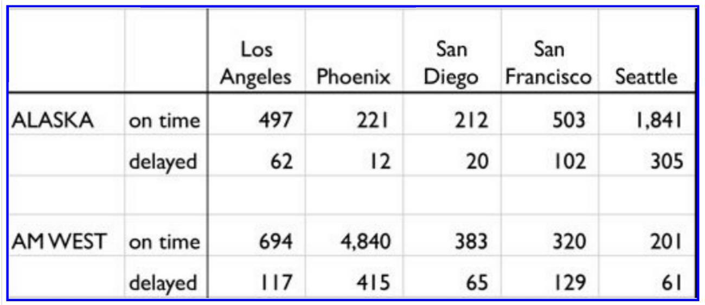

```{r setup, include=FALSE}
knitr::opts_chunk$set(echo = TRUE)
library(DT)
library(dplyr)
library(tidyr)
library(stringr)
library(ggplot2)
```

# Tidying and Transforming data

```{r, out.height=1000, out.width=1000 }

```

The chart above describes arrival delays for two airlines across five destinations. Your task is to:

## Create a .CSV file from data

(1) Create a .CSV file (or optionally, a MySQL database!) that includes all of the information above. You're encouraged to use a "wide" structure similar to how the information appears above, so that you can practice tidying and transformations as described below.

All tidying and transformation activities will be performed using appropriate functions from the `tidyr` and `dplyr` packages

First, the above information was manually captured as comma separated values and stored in a .csv file
Let's read the .csv file to see how the data looks

## Read .csv file, clean and transform data
(2) Read the information from your .CSV file into R, and use tidyr and dplyr as needed to tidy and transform your data.

```{r}
untidyData <- read.csv("airlineDepartures.csv", header = TRUE, stringsAsFactors = FALSE) # Read the .csv file
untidyData
```

In its form right now, the data is completely untidy and filled with unavailable data.

Let's rename the first two columns to `airline` and `flightStatus` respectively

```{r}

names(untidyData)[1:2] <- c('airline', 'flightStatus')
untidyData
```

Next, Fill in the row spaces on the `delay` rows on the `flightStatus` column with the appropriate airline

```{r}

untidyData[2, 1] <- 'ALASKA'
untidyData[5, 1] <- 'AM WEST'
untidyData
```

Let's remove the third row since it is completely empty

```{r}

df <- untidyData[-3, ]
df
```

Now the data looks a bit in order in a wide form which can be presented to managers and other users, but it is not completely suitable for analysis and visualisation

On observation, columns 3 to 7 need to be values under a single column say `destination`
using the `gather` function from `tidyr`

```{r}

df <- gather(df, c(Los.Ageles:Seattle), key = 'destination', value = 'tally')
df

df2 <- df # This will be used in this format for analysis later
```

We are gradually getting to the desired format.
Next, the values for the `flightStatus` column can be `spread` out into two columns namely `on time` and `delayed`

```{r}

df <- spread(df, 'flightStatus', 'tally')
df
```


```{r}
datatable(df, class = 'cell-border stripe', options = list(
  initComplete = JS(
    "function(settings, json) {",
    "$(this.api().table().header()).css({'background-color': '#616161', 'color': '#fff', 'text-align': 'center !important'});",
    "$(this.api().table().body()).css({'color': '#000', 'text-align': 'center !important'});",
    "}")
))

```

The data is cleaned up now and ready for downstream analysis and visualisations. But before then, it will be btter to remove the empty space in the `on time` variable for easy referencing

```{r}
names(df) <- make.names(names(df))
df

```


## Analyse data
(3) Perform analysis to compare the arrival delays for the two airlines.

Let's compare the total number of flights(whether delayed or on time) for both airlines to all the cities using `df2`

```{r}

grpdf <- df2 %>% 
  group_by(airline)%>%summarize(TotalFlights = sum(tally))
grpdf
```


To compare the total number of delayed and on time flights for both airlines, we will use `df` as the shape is suitable for it

```{r}
d <- df %>% group_by(airline)%>%summarise_at(c("delayed", "on.time"), sum)
d
```

##### From the above result, it seems the ALASKA airline has the tendency of departing more `on time` despite having fewer flights than AM West.

Let's see what their delay rates look ike


```{r}

delayRateAlaska <- d[1, 'delayed'] / (d[1, 'delayed'] + d[1, 'on.time'])
paste('The dalay rate for ALASKA is: ', round(delayRateAlaska$delayed * 100, 2), '%', sep = '')

```

```{r}
delayRateAmWest <- d[2, 'delayed'] / (d[2, 'delayed'] + d[2, 'on.time'])
paste('The dalay rate for AM WEST is: ', round(delayRateAmWest$delayed * 100, 2), '%', sep = '')
```

##### So in overall, ALASKA airline seems to have a higher tendency for its flights to be delayed than AM WEST


Let's see how this can compare against each other in visualisation

```{r}
ggplot(filter(df2, flightStatus=="delayed"),aes(destination,tally,color=airline))+geom_point(size=5)+ggtitle("All Delayed Flights")+ylab("Delays")
```

##### From the plot above, AM West airline had so much delayed flight to Phoenix

Let's see how these stack up against each other on a Bar plot when we sum the total flights per airline per city

```{r}

r<-df2 %>% spread(flightStatus,tally)%>%mutate(numFlights = rowSums(.[,3:4]), freq= .[,3]/numFlights)
r
```

```{r}
ggplot(r,aes(x=destination,y=freq))+geom_bar(aes(fill=airline),stat="identity",position="dodge")+ylab("Rate of delays")+ggtitle("All Delayed Flights per city")

```

## Conclusion
(4) Your code should be in an R Markdown file, posted to rpubs.com, and should include narrative descriptions of your data cleanup work, analysis, and conclusions. Please include in your homework submission:
??? The URL to the .Rmd file in your GitHub repository. and
??? The URL for your rpubs.com web page.

##### In conclusion:
***
##### From the plots above, it is evident that Alaska Airline performs better as it has the lowest delays per city. Therefore, this can be a good helper in terms of deciding which airline to board when going to any of these cities.
##### If the overall results are considered, AM WEST performs better but when looked at city by city, ALASKA airline has a better performance 
***


