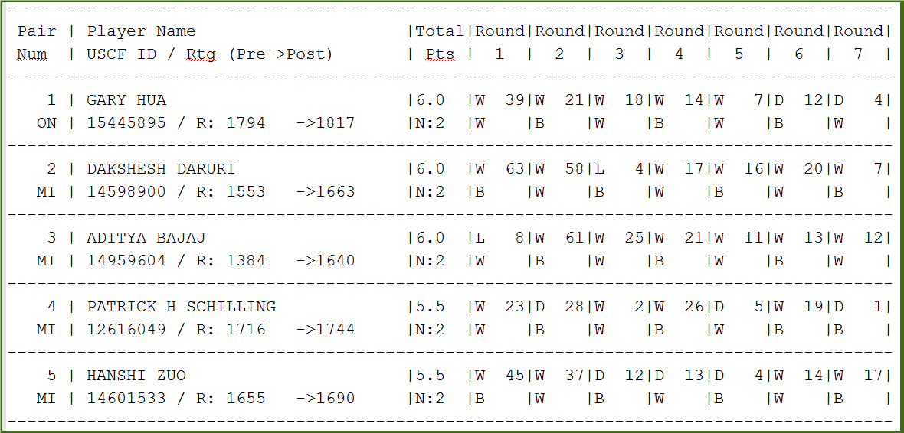

```{r setup, include=FALSE}
knitr::opts_chunk$set(echo = TRUE)
library(dplyr)
library(stringr)
library(DT)
```


# Chess Tournament Results
Given a text file with chess tournament results where the information has some structure. We need to create an R Markdown file that generates a .CSV file that could be imported into a SQL database.

## Overview

The structure of the first 5 entries in the text file is shown below

```{r, out.width = "850px"}

```

From the image above, each player has:

#### Player's specific inromation which include:
* Player's Name
* Player's State
* Total Number of Points
* Player's Pre-Rating 
* Post-Chess Rating

For the first player, the information would be:
Gary Hua, ON, 6.0, 1794, 1605
1605 was calculated by using the pre-tournament opponents' ratings of 1436, 1563, 1600, 1610, 1649, 1663, 1716, and dividing by the total number of games played.

Each player has a record of seven matches

#### Player's match inromation include:
* Round (1 - 7) 
* Outcome (Win, Loss, Draw) 
* Opponent's Player Number

The players' information when the Opponents' average pre-chess ratings are computed,
will be extracted and exported to a .csv file with the data ready for export/upload to a database

## Load raw data

```{r}
# Read the text file directly from the host
tournaments <- read.table('https://raw.githubusercontent.com/henryvalentine/MSDS2019/master/Classes/DATA%20607/Projects/Project1/tournamentinfo.txt',sep="\n",stringsAsFactors = F,skip=4)

```

```{r}

w <- str_extract_all(tournaments[[1]], '(\\w.+)')
df <- data.frame(matrix(unlist(w), byrow=T))[1]
```


## Extract required values
```{r}

# matches <- data.frame()
extractValues <- function()
{
  # FOR PLAYERS
  ids <- vector()
  names <- vector()
  uscfIds <- vector()
  preRatings <- vector()
  postRatings <- vector()
  states <- vector() 
  points <- vector()
  
  # FOR MATCHES
  opponents <- vector()
  matches <- vector() 
  playerIds <- vector()
  
  # PROCESS THE RAW DATA
   i <- 1
   len <- nrow(df)
   while(i < len)
   {
      v <- df[i,] #FOCUSES ON LINE i (ODD ROW) TO EXTRACT PLAYER INFO
      x <- df[i+1,] # FOCUSES ON LINE i+1 (EVEN ROW) TO EXTRACT GAMES INFO
      
      
      playerNum <- as.numeric(str_extract(v, '\\d{1,}'))
      name <- str_trim(str_extract(v, '[[:alpha:] ]{2,}'), side='both')
      uscfId <- as.numeric(str_extract(x, '\\d+(?=)'))
      preRating <- as.numeric(str_extract_all(x, '(?<=R: ).\\d+(?=)'))
      postRating <- as.numeric(str_extract(x, '(?<=->).\\d+(?=)'))
      state <-   str_extract(x, '[A-Z]{2,}')
      point <- as.numeric(str_extract(v, '\\d+(\\.\\d+)'))
      games <- str_extract_all(v, '([A-Z] + \\d+)')
      game1 <- games[[1]][1]
      game2 <- games[[1]][2]
      game3 <- games[[1]][3]
      game4 <- games[[1]][4]
      game5 <- games[[1]][5]
      game6 <- games[[1]][6]
      game7 <- games[[1]][7]
      
      game1Outcome <- str_extract(game1, '\\w')
      match1 <- sprintf('1 : %s', game1Outcome)
      game1Opponent <- str_extract(game1, '\\d+')
      
      game2Outcome <- str_extract(game2, '\\w')
      match2 <- sprintf('2 : %s', game2Outcome)
      game2Opponent <- str_extract(game2, '\\d+')
      
      game3Outcome <- str_extract(game3, '\\w')
      match3 <- sprintf('3 : %s', game3Outcome)
      game3Opponent <- str_extract(game3, '\\d+')
      
      game4Outcome <- str_extract(game4, '\\w')
      match4 <- sprintf('4 : %s', game4Outcome)
      game4Opponent <- str_extract(game4, '\\d+')
      
      game5Outcome <- str_extract(game5, '\\w')
      match5 <- sprintf('5 : %s', game5Outcome)
      game5Opponent <- str_extract(game5, '\\d+')
      
      game6Outcome <- str_extract(game6, '\\w')
      match6 <- sprintf('6 : %s', game6Outcome)
      game6Opponent <- str_extract(game6, '\\d+')
      
      game7Outcome <- str_extract(game7, '\\w')
      match7 <- sprintf('7 : %s', game7Outcome)
      game7Opponent <- str_extract(game7, '\\d+')
      
      ids <- c(ids, playerNum)
      names <- c(names, name)
      uscfIds <- c(uscfIds, uscfId)
      preRatings <- c(preRatings, preRating)
      postRatings <- c(postRatings, postRating)
      states <- c(states, state) 
      points <- c(points, point)
      
      
      opponents <- append(opponents, c(as.numeric(game1Opponent), as.numeric(game2Opponent),
                   as.numeric(game3Opponent), as.numeric(game4Opponent), as.numeric(game5Opponent), 
                   as.numeric(game6Opponent), as.numeric(game7Opponent)), after = length(opponents))
      
      # REPLICATE EACH PLAYER ID ACCORDING TO THE NUMBER OF GAMES PLAYED (7 GAMES)
      playerIds <- append(playerIds, c(replicate(7, playerNum)), after = length(playerIds))
      
      matches <- append(matches, c(match1, match2, match3, match4, match5, match6, match7), after = length(matches))
      
      i <- i + 2 # INCREMENTING i BY 2 HELPS TO MOVE THE FOCUS TO THE NEXT ODD ROW
   }
   
   # PLAYERS
   players <- data.frame(id = ids, name = names, uscfId = uscfIds, preRating = preRatings, postRating = postRatings, 
                         state = states, point = points)
   
   #GAMES
   matchesPlayed <- data.frame(id = playerIds, rounds = matches, opponents = opponents)
   
   return(list(players = players, matches = matchesPlayed))
}
```

```{r}

dfAll <- extractValues()

```

## Players
```{r}

playersInfo <- na.omit(dfAll$players)

datatable(playersInfo, colnames= c("Player Id", "Name", "UscfId", "Pre-Rating", "Post-Rating", "State", "Total Points"), class = 'cell-border stripe', options = list(
  initComplete = JS(
    "function(settings, json) {",
    "$(this.api().table().header()).css({'background-color': 'steelblue', 'color': '#fff', 'text-align': 'center !important'});",
    "$(this.api().table().body()).css({'color': '#000', 'text-align': 'center !important'});",
    "}")
))
```

## Games played

```{r}

gamesInfo <- na.omit(dfAll$matches)

```


#### Retrieve each player's Opponents' pre-chess rating from the Player Info dataset
```{r}

t <- vector()
for(i in na.omit(gamesInfo$opponents))
{
  f <- playersInfo$preRating[playersInfo$id == i]
  t <- c(t, f)
}

```

#### Add the Opponents' pre-chess rating column to the Games Info dataset
```{r}

gamesInfo['opponentPreRating'] <- t

```

```{r}

datatable(gamesInfo, colnames= c("Player Id", "Round : Outcome", "Opponents", "Opponent's Pre-rating"), class = 'cell-border stripe', options = list(
  initComplete = JS(
    "function(settings, json) {",
    "$(this.api().table().header()).css({'background-color': 'steelblue', 'color': '#fff', 'text-align': 'center !important'});",
    "$(this.api().table().body()).css({'color': '#000', 'text-align': 'center !important'});",
    "}")
))
```

## Final result
#### Calculate each Player's opponents' average Pre-chess ratings, add the values to the Players' Info dataset to get the final result

```{r}

finalResult <-  
    gamesInfo %>%
    group_by(id) %>% summarise(opponents_avg_pre_rating = round(mean(opponentPreRating))) %>%
    inner_join(playersInfo, by="id") %>%
    select(id, name, uscfId, preRating, postRating, opponents_avg_pre_rating, state, point)

```

#### View Final result
```{r}
datatable(finalResult, colnames= c("Player Id", "Name", "UscfId", "Pre-Rating", "Post-Rating", "Opp. Ave. Pre-rating", "State", "Total Points"), class = 'cell-border stripe', options = list(
  initComplete = JS(
    "function(settings, json) {",
    "$(this.api().table().header()).css({'background-color': '#337ab7', 'color': '#fff', 'text-align': 'center !important'});",
    "$(this.api().table().body()).css({'color': '#000', 'text-align': 'center !important'});",
    "}")
))
```

#### Export Final result to a .csv file with the data ready for upload to a Database

[chessPlayers.csv]('https://raw.githubusercontent.com/henryvalentine/MSDS2019/master/Classes/DATA%20607/Projects/Project1/ChessPlayers.csv')

```{r}

write.csv(finalResult, "ChessPlayers.csv", row.names=FALSE)

```

## Session Info

```{r}
sessionInfo()

```
